# MATPLOTLIB

En **Matplotlib** todo el desarrollo gráfico lo realizaremos a través del interfaz de **Pyplot**. 

La visualización se desarrolla de forma sistemática, es decir, cada comando de pyplot genera una modificación en la gráfica que estemos realizando.

Al igual que muchas librerías de python, pyplot es comúnmente utilizada bajo un alias **plt**, comenzaremos importando la librería.


```python
import matplotlib.pyplot as plt
```

Realizaremos una gráfica muy simple para comenzar, pintar los elementos de una lista


```python
lista = [1, 5, 10, 15, 20, 25, 30]
```

Lo primero que haremos para realizar una gráfica es llamar a la función <code>**plot**</code>


```python
# Comenzamos una visualización
plt.plot(lista)
```


    [<matplotlib.lines.Line2D at 0x19526a24708>]


    
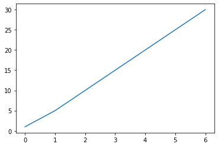
    


Vemos que simplemente mostramos cada valor de índice con su valor correspondiente valor de la lista.

Podemos agregarle algunos elementos de estilo como etiquetas al eje *y*, y al eje *x*. Para ello, agregamos un nuevo componente con <code>**ylabel**</code> o <code>**xlabel**</code>


```python
plt.ylabel('Valores de la lista')
plt.xlabel('Valores de índice')
```


    Text(0.5, 0, 'Valores de índice')


    
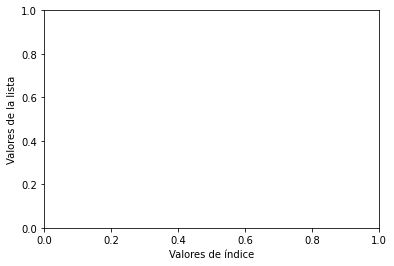
    


Como podemos comprobar no aparece nada de la lista anterior, para que pyplot tome en cuenta todos los elementos que estamos agregando a una gráfica y los muestre correctamente por pantalla, tenemos que definir donde acaba nuestra gráfica con la función <code>**show**</code>


```python
plt.plot(lista)
plt.ylabel('Valores de la lista')
plt.xlabel('Valores de índice')
plt.show()
```


    

    


Ahora que ya sabemos imprimir algo básico como una lista contra su propio índice, vamos a realizar una modificación y en lugar de mostrar en el eje x el índice mostraremos otra lista con valores diferentes.


```python
lista_2 = [4, 5, 8, 3, 15, 12, 9]

plt.plot(lista, lista_2)
plt.ylabel('Valores de la lista')
plt.xlabel('Valores de índice')
plt.show()
```


    
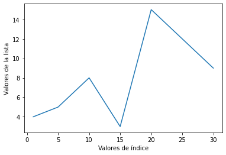
    


En vista de esta nueva gráfica, es importante resaltar algo:
* El eje de abscisas **x** toma el valor del primer parámetro (en su ausencia será el índice de la lista)
* El eje de abscisas **y** toma el valor del segundo parámetro.

En algunas ocasiones, podemos necesitar unos ejes más amplios o reducidos para nuestras gráficas para ello podemos realizar una nueva lista que contenga 4 valores:
* Eje inicio x
* Eje fin x
* Eje inicio y
* Eje fin y

Estos valores los pasaremos al parámetro <code>**axis**</code>


```python
lista_eje = [0, 40, 0, 20]

plt.plot(lista, lista_2)
plt.axis(lista_eje)
plt.ylabel('Valores de la lista')
plt.xlabel('Valores de índice')
plt.show()
```


    

    


Finalmente, sobre nuestra primera gráfica, podemos decidir cambiar el color, esto se realiza desde el parámetro **plot**, tras los argumentos de entrada de los ejes x e y, podemos definir el color a través del parámetro <code>**color**</code>


```python
plt.plot(lista, lista_2, color='green')
plt.ylabel('Valores de ala lista')
plt.xlabel('Valores de índice')
plt.show()
```


    
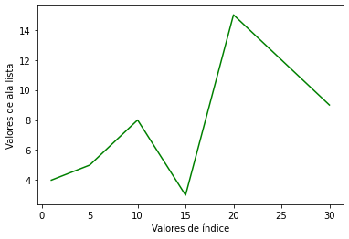
    


```python
plt.plot(lista, lista_2, color='gold')
plt.ylabel('Valores de ala lista')
plt.xlabel('Valores de índice')
plt.show()
```


    
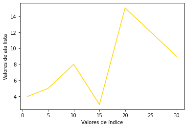
    


Podemos encontrar una lista de colores que podemos utilizar en el siguiente enlace: https://matplotlib.org/3.1.0/gallery/color/named_colors.html

Otra función de interés es la de agregar título a una gráfica, esto lo realizamos desde <code>**title**</code>


```python
plt.plot(lista, lista_2, color='red')
plt.title('Mi título')
plt.ylabel('Valores de ala lista')
plt.xlabel('Valores de índice')
plt.show()
```


    
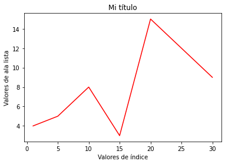
    


En estos primeros ejemplos hemos visto cómo jugar con la amplitud de ejes y mostrar dos listas. Sin embargo, es habitual que se superpongan diferentes variables en una misma gráfica, el proceso es el mismo, es decir, tenemos que ir añadiendo elementos con plot.


```python
import numpy as np

valores = np.linspace(0, 2, 100)
```


```python
plt.plot(valores)
plt.plot(valores**2)
plt.plot(valores**3)

plt.xlabel('Ítem')
plt.ylabel('Valor')

plt.title("Transformación de una varaible")

plt.show()
```


    
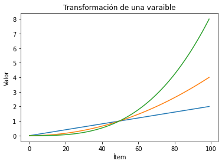
    


Cuando añadimos más de una variable a la gráfica automáticamente se define el color y la amplitud del eje x e y. En estos casos es interesante añadir una leyenda a nuestra gráfica. 

Para añadir una leyenda, tenemos que utilizar la función <code>**legend()**</code>, pero, en cada elemento plot, tenemos que utilizar el parámetro <code>**label**</code> para añadir el texto que aparecerá en la leyenda de nuestra gráfica.


```python
plt.plot(valores, color = 'red', label = 'Lineal')
plt.plot(valores**2, color = 'blue', label = 'Cuadrática')
plt.plot(valores**3, color = 'green', label = 'Cúbica')

plt.xlabel('Ítem')
plt.ylabel('Valor')
plt.title("Transformación de una varaible")
plt.legend()

plt.show()
```


    

    


No solamente podemos utilizar líneas como formas para representar nuestras gráficas, si no que, existen otro tipo de elementos que podemos representar. Puede consultarse una lista completa de estos elementos desde el siguiente enlace: https://matplotlib.org/3.1.1/api/markers_api.html


```python
plt.plot(valores, color = 'red', label = 'Lineal', marker='.') 
plt.plot(valores**2, color = 'blue', label = 'Cuadrática', marker = '^' )
plt.plot(valores**3, color = 'green', label = 'Cúbica', marker='s')

plt.xlabel('Ítem')
plt.ylabel('Valor')
plt.title("Transformación de una varaible")
plt.legend()

plt.show()
```


    

    


Mostramos un ejempo más nítido.


```python
t = np.arange(0., 5., 0.2)

plt.plot(t, t, '--')
plt.plot(t, t**2, 's')
plt.plot(t, t**3, '^')
plt.show()
```


    
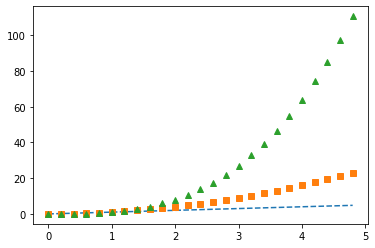
    


Mediante **Pyplot**, podemos también añadir en un mismo espacio gráfico más de una visualización, para ello existe esta importante función <code>**subplot**</code>, recibe los siguientes parámetros:
* Número filas
* Número columnas
* Índice (posición)

Mostraremos un ejemplo de dos gráficas (por lo tanto, dos filas, una columna y hasta dos gráficas) 


```python
def balance(t):
    return np.exp(-t) * np.cos(2*np.pi*t)

my_array_one = np.arange(0.0, 5.0, 0.1)
my_array_dos = np.arange(0.0, 5.0, 0.02)

plt.subplot(211)
plt.plot(my_array_one, balance(my_array_one), 'bo')
plt.plot(my_array_dos, balance(my_array_dos), 'k')

plt.subplot(212)
plt.plot(my_array_dos, np.cos(2*np.pi*my_array_dos), 'r--')
plt.show()
```


    

    


Antes de pasar diferentes tipos de gráficas, mostraremos cómo añadir texto en el interior de una visualización. 

La función <code>**text**</code> seguido de la posición x e y donde irá el texto, nos permitirá añadir texto dentro de una visualización. Tomaremos la gráfica anterior como ejemplo.


```python
plt.plot(valores, color = 'red', label = 'Lineal')
plt.plot(valores**2, color = 'blue', label = 'Cuadrática')
plt.plot(valores**3, color = 'green', label = 'Cúbica')

plt.text(80, 5, 'Transformada cúbica')
plt.xlabel('Ítem')
plt.ylabel('Valor')
plt.title("Transformación de una varaible")
plt.legend()

plt.show()
```


    
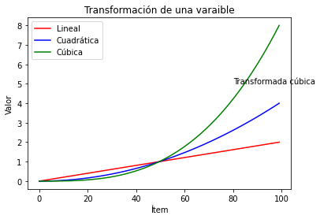
    


Como vemos, tenemos que tener cuiado con la posición, lo reedistribuimos


```python
plt.plot(valores, color = 'red', label = 'Lineal')
plt.plot(valores**2, color = 'blue', label = 'Cuadrática')
plt.plot(valores**3, color = 'green', label = 'Cúbica')

plt.text(45, 5, 'Transformada cúbica')
plt.text(60, 0.8, 'Original')
plt.text(80, 1.3, 'Cuadrática')

plt.xlabel('Ítem')
plt.ylabel('Valor')
plt.title("Transformación de una varaible")
plt.legend()

plt.show()
```


    
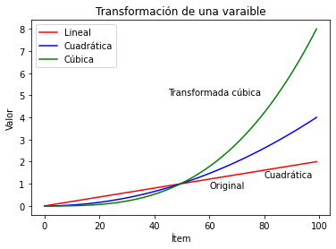
    


Ahora, mostraremos algunos tipos de gráfica diferente de la líneal.

## Histograma.


```python
mu = 150  # Media de la distribución
sigma = 15  # Desviación estandar de la distribución
x = mu + sigma * np.random.randn(1000) # Distribución normal de 1000 elementos

num_bins = 100
```


```python
# Mostramos valores
n, bins, patches = plt.hist(x, num_bins, density=1, color='lightgreen')

# Distribución normal
y = ((1 / (np.sqrt(2 * np.pi) * sigma)) *
     np.exp(-0.5 * (1 / sigma * (bins - mu))**2))

plt.plot(bins, y, 'b--')
plt.xlabel('Frecuencia')
plt.ylabel('Valor')

plt.show()
```


    

    


## DIAGRAMA DE BARRAS

Para mostrar cómo se realiza un diagrama de barras, vamos a generar una serie de fechas, 12 días y 2 arrays para simular los índices de calidad de aire de dos ciudades.


```python
import pandas as pd
fechas = pd.date_range('20200101',periods=12)

air_quality = pd.DataFrame(np.random.randint(10, 50, 24).reshape(12,2), 
                      index=fechas, 
                      columns = ["AQI Madrid", "AQI Barcelona"])
air_quality
```


<div>
<style scoped>
    .dataframe tbody tr th:only-of-type {
        vertical-align: middle;
    }

    .dataframe tbody tr th {
        vertical-align: top;
    }

    .dataframe thead th {
        text-align: right;
    }
</style>
<table border="1" class="dataframe">
  <thead>
    <tr style="text-align: right;">
      <th></th>
      <th>AQI Madrid</th>
      <th>AQI Barcelona</th>
    </tr>
  </thead>
  <tbody>
    <tr>
      <td>2020-01-01</td>
      <td>17</td>
      <td>11</td>
    </tr>
    <tr>
      <td>2020-01-02</td>
      <td>43</td>
      <td>14</td>
    </tr>
    <tr>
      <td>2020-01-03</td>
      <td>18</td>
      <td>27</td>
    </tr>
    <tr>
      <td>2020-01-04</td>
      <td>35</td>
      <td>33</td>
    </tr>
    <tr>
      <td>2020-01-05</td>
      <td>49</td>
      <td>49</td>
    </tr>
    <tr>
      <td>2020-01-06</td>
      <td>30</td>
      <td>10</td>
    </tr>
    <tr>
      <td>2020-01-07</td>
      <td>47</td>
      <td>33</td>
    </tr>
    <tr>
      <td>2020-01-08</td>
      <td>34</td>
      <td>49</td>
    </tr>
    <tr>
      <td>2020-01-09</td>
      <td>32</td>
      <td>36</td>
    </tr>
    <tr>
      <td>2020-01-10</td>
      <td>36</td>
      <td>16</td>
    </tr>
    <tr>
      <td>2020-01-11</td>
      <td>22</td>
      <td>23</td>
    </tr>
    <tr>
      <td>2020-01-12</td>
      <td>32</td>
      <td>28</td>
    </tr>
  </tbody>
</table>
</div>


```python
air_quality.plot(kind="barh", title="Air Quality Index")
```


    <matplotlib.axes._subplots.AxesSubplot at 0x195282c4248>


    
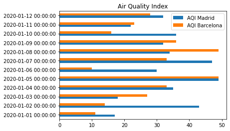
    


```python
air_quality.plot(kind="barh", subplots=True)
```

    C:\Users\JMMoreno\Anaconda3\lib\site-packages\pandas\plotting\_matplotlib\tools.py:307: MatplotlibDeprecationWarning: 
    The rowNum attribute was deprecated in Matplotlib 3.2 and will be removed two minor releases later. Use ax.get_subplotspec().rowspan.start instead.
      layout[ax.rowNum, ax.colNum] = ax.get_visible()
    C:\Users\JMMoreno\Anaconda3\lib\site-packages\pandas\plotting\_matplotlib\tools.py:307: MatplotlibDeprecationWarning: 
    The colNum attribute was deprecated in Matplotlib 3.2 and will be removed two minor releases later. Use ax.get_subplotspec().colspan.start instead.
      layout[ax.rowNum, ax.colNum] = ax.get_visible()
    C:\Users\JMMoreno\Anaconda3\lib\site-packages\pandas\plotting\_matplotlib\tools.py:313: MatplotlibDeprecationWarning: 
    The rowNum attribute was deprecated in Matplotlib 3.2 and will be removed two minor releases later. Use ax.get_subplotspec().rowspan.start instead.
      if not layout[ax.rowNum + 1, ax.colNum]:
    C:\Users\JMMoreno\Anaconda3\lib\site-packages\pandas\plotting\_matplotlib\tools.py:313: MatplotlibDeprecationWarning: 
    The colNum attribute was deprecated in Matplotlib 3.2 and will be removed two minor releases later. Use ax.get_subplotspec().colspan.start instead.
      if not layout[ax.rowNum + 1, ax.colNum]:
    


    array([<matplotlib.axes._subplots.AxesSubplot object at 0x000001952832F908>,
           <matplotlib.axes._subplots.AxesSubplot object at 0x0000019528356548>],
          dtype=object)


    
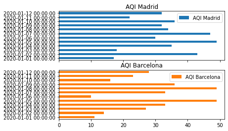
    


```python
# Datos sobre temperatura
temp_max = [35, 38, 29, 27]
temp_min = [23, 22, 21, 18]
n_groups = len(temp_max)

index = np.arange(n_groups)

max_ = plt.bar(index, temp_max, color='tomato', 
                 label='T. Max')

min_ = plt.bar(index , temp_min, color='lightgreen', 
                 label='T. Min')

plt.xlabel('Ciudades')
plt.ylabel('Temperaturas')
plt.title('Temperatura por ciudad')
plt.xticks(index , ('Madrid', 'Barcelona', 'Asturias', 'Burgos'))
plt.legend()

plt.tight_layout()
plt.show()
```


    
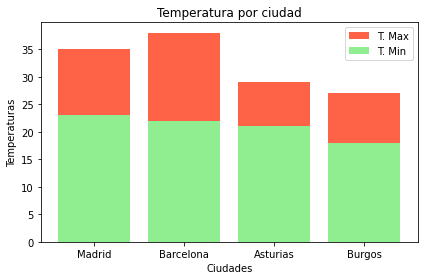
    


## DIAGRAMA CIRCULAR


```python
politics = ('PSOE', 'PP', 'VOX', 'PODEMOS', 'ERC', 'Cs')
votos = [35, 28, 17, 12, 5, 3 ]

explode = (0.2, 0.0, 0, 0, 0, 0)  # Resaltar hacia afuera una porción.

plt.pie(votos, explode=explode, labels=politics, autopct='%1.1f%%',
        shadow=True, startangle=90, 
        colors = ('r', 'b', 'g', 'purple', 'yellow', 'orange' ))

plt.axis('equal')  # Centrar el gráfico

plt.show()
```


    
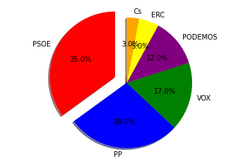
    


## NUBE DE PUNTOS


```python
data_1 = np.random.randint(0, 80, 100)
data_2 = np.random.randint(0, 80, 100)
rangos = np.arange(100)

plt.scatter(rangos, data_1, color='r')
plt.scatter(rangos, data_2, color='b')

plt.xlabel('Estudio 1')
plt.ylabel('Estudio 2')
plt.show()
```


    

    

