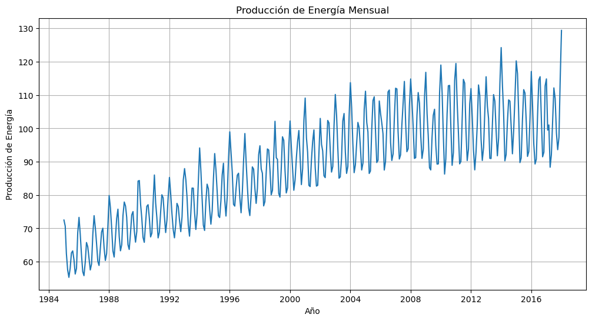
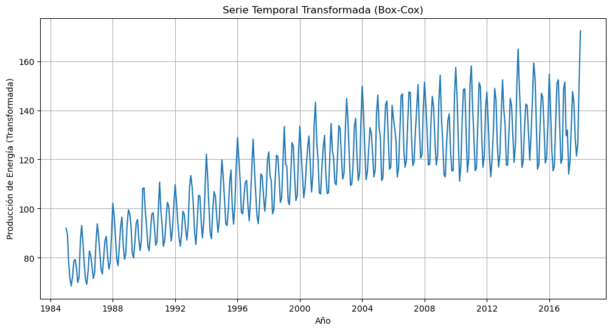

```python
# Importar pandas como pd
import pandas as pd
```


```python
# Importar numpy como np
import numpy as np
```


```python
# Importar matplotlib.pyplot como plt
import matplotlib.pyplot as plt
```


```python
# Importar SARIMAX de statsmodels.tsa.statespace
from statsmodels.tsa.statespace.sarimax import SARIMAX
```


```python
# Importar random
import random
```


```python
# Importar math
import math

```


```python
# Importar boxcox de scipy.stats
from scipy.stats import boxcox
```


```python
# Importar acorr_ljungbox de statsmodels.stats.diagnostic
from statsmodels.stats.diagnostic import acorr_ljungbox
```


```python
# Cargar los datos
data = pd.read_csv('Electric_Production.csv')
data['DATE'] = pd.to_datetime(data['DATE'])
data.set_index('DATE', inplace=True)
```


```python
# Visualizar los datos
plt.figure(figsize=(12, 6))
plt.plot(data.index, data['IPG2211A2N'])
plt.title('Producción de Energía Mensual')
plt.xlabel('Año')
plt.ylabel('Producción de Energía')
plt.grid(True)
plt.show()
```


    

    


```python
# Aplicar transformación Box-Cox
data['Transformed'], _ = boxcox(data['IPG2211A2N'])
```


```python
# Visualizar la serie transformada
plt.figure(figsize=(12, 6))
plt.plot(data.index, data['Transformed'])
plt.title('Serie Temporal Transformada (Box-Cox)')
plt.xlabel('Año')
plt.ylabel('Producción de Energía (Transformada)')
plt.grid(True)
plt.show()
```


    

    


```python
# Función para calcular RMSE
def rmse(y_true, y_pred):
    return np.sqrt(np.mean((y_true - y_pred) ** 2))
```


```python
# Función de Recocido Simulado
def recocido_simulado(data, max_iteraciones=30, temperatura_inicial=10):
    mejores_parametros = (1, 1, 1, 1)  # Inicializar los mejores parámetros
    mejor_rmse = float('inf')  # Inicializar con un valor alto

    parametros_actuales = mejores_parametros
    rmse_actual = mejor_rmse

    temperatura = temperatura_inicial

    for _ in range(max_iteraciones):
        parametros_vecinos = tuple(random.choice([-1, 1]) * random.randint(0, 8) + parametros_actuales[i] for i in range(4))
        parametros_vecinos = tuple(max(0, x) for x in parametros_vecinos)  # Garantizar que no haya valores negativos

        modelo = SARIMAX(data['Transformed'], order=parametros_vecinos[:3], seasonal_order=(0, 0, 0, 0))
        resultado = modelo.fit(disp=False)
        predicciones = resultado.get_forecast(steps=50).predicted_mean
        datos_validacion = data['Transformed'][-50:]
        rmse_vecino = rmse(datos_validacion, predicciones)

        if rmse_vecino < rmse_actual or random.random() < math.exp((rmse_actual - rmse_vecino) / temperatura):
            parametros_actuales = parametros_vecinos
            rmse_actual = rmse_vecino

            if rmse_actual < mejor_rmse:
                mejores_parametros = parametros_actuales
                mejor_rmse = rmse_actual

        temperatura *= 0.95  # Factor de reducción de temperatura

    return mejores_parametros
```


```python
# Ejecutar el algoritmo de Recocido Simulado
mejores_parametros = recocido_simulado(data)
print('Mejores parámetros SARIMA:', mejores_parametros)
```

    D:\anaconda3\Lib\site-packages\statsmodels\tsa\base\tsa_model.py:471: ValueWarning: No frequency information was provided, so inferred frequency MS will be used.
      self._init_dates(dates, freq)
    D:\anaconda3\Lib\site-packages\statsmodels\tsa\base\tsa_model.py:471: ValueWarning: No frequency information was provided, so inferred frequency MS will be used.
      self._init_dates(dates, freq)
    D:\anaconda3\Lib\site-packages\statsmodels\tsa\base\tsa_model.py:471: ValueWarning: No frequency information was provided, so inferred frequency MS will be used.
      self._init_dates(dates, freq)
    D:\anaconda3\Lib\site-packages\statsmodels\tsa\base\tsa_model.py:471: ValueWarning: No frequency information was provided, so inferred frequency MS will be used.
      self._init_dates(dates, freq)
    D:\anaconda3\Lib\site-packages\statsmodels\tsa\statespace\sarimax.py:966: UserWarning: Non-stationary starting autoregressive parameters found. Using zeros as starting parameters.
      warn('Non-stationary starting autoregressive parameters'
    D:\anaconda3\Lib\site-packages\statsmodels\base\model.py:604: ConvergenceWarning: Maximum Likelihood optimization failed to converge. Check mle_retvals
      warnings.warn("Maximum Likelihood optimization failed to "
    D:\anaconda3\Lib\site-packages\statsmodels\tsa\base\tsa_model.py:471: ValueWarning: No frequency information was provided, so inferred frequency MS will be used.
      self._init_dates(dates, freq)
    D:\anaconda3\Lib\site-packages\statsmodels\tsa\base\tsa_model.py:471: ValueWarning: No frequency information was provided, so inferred frequency MS will be used.
      self._init_dates(dates, freq)
    D:\anaconda3\Lib\site-packages\statsmodels\tsa\statespace\sarimax.py:966: UserWarning: Non-stationary starting autoregressive parameters found. Using zeros as starting parameters.
      warn('Non-stationary starting autoregressive parameters'
    D:\anaconda3\Lib\site-packages\statsmodels\tsa\statespace\sarimax.py:978: UserWarning: Non-invertible starting MA parameters found. Using zeros as starting parameters.
      warn('Non-invertible starting MA parameters found.'
    


    ---------------------------------------------------------------------------

    LinAlgError                               Traceback (most recent call last)

    Cell In[15], line 2
          1 # Ejecutar el algoritmo de Recocido Simulado
    ----> 2 mejores_parametros = recocido_simulado(data)
          3 print('Mejores parámetros SARIMA:', mejores_parametros)
    

    Cell In[14], line 16, in recocido_simulado(data, max_iteraciones, temperatura_inicial)
         13 parametros_vecinos = tuple(max(0, x) for x in parametros_vecinos)  # Garantizar que no haya valores negativos
         15 modelo = SARIMAX(data['Transformed'], order=parametros_vecinos[:3], seasonal_order=(0, 0, 0, 0))
    ---> 16 resultado = modelo.fit(disp=False)
         17 predicciones = resultado.get_forecast(steps=50).predicted_mean
         18 datos_validacion = data['Transformed'][-50:]
    

    File D:\anaconda3\Lib\site-packages\statsmodels\tsa\statespace\mlemodel.py:704, in MLEModel.fit(self, start_params, transformed, includes_fixed, cov_type, cov_kwds, method, maxiter, full_output, disp, callback, return_params, optim_score, optim_complex_step, optim_hessian, flags, low_memory, **kwargs)
        702         flags['hessian_method'] = optim_hessian
        703     fargs = (flags,)
    --> 704     mlefit = super(MLEModel, self).fit(start_params, method=method,
        705                                        fargs=fargs,
        706                                        maxiter=maxiter,
        707                                        full_output=full_output,
        708                                        disp=disp, callback=callback,
        709                                        skip_hessian=True, **kwargs)
        711 # Just return the fitted parameters if requested
        712 if return_params:
    

    File D:\anaconda3\Lib\site-packages\statsmodels\base\model.py:563, in LikelihoodModel.fit(self, start_params, method, maxiter, full_output, disp, fargs, callback, retall, skip_hessian, **kwargs)
        560     del kwargs["use_t"]
        562 optimizer = Optimizer()
    --> 563 xopt, retvals, optim_settings = optimizer._fit(f, score, start_params,
        564                                                fargs, kwargs,
        565                                                hessian=hess,
        566                                                method=method,
        567                                                disp=disp,
        568                                                maxiter=maxiter,
        569                                                callback=callback,
        570                                                retall=retall,
        571                                                full_output=full_output)
        572 # Restore cov_type, cov_kwds and use_t
        573 optim_settings.update(kwds)
    

    File D:\anaconda3\Lib\site-packages\statsmodels\base\optimizer.py:241, in Optimizer._fit(self, objective, gradient, start_params, fargs, kwargs, hessian, method, maxiter, full_output, disp, callback, retall)
        238     fit_funcs.update(extra_fit_funcs)
        240 func = fit_funcs[method]
    --> 241 xopt, retvals = func(objective, gradient, start_params, fargs, kwargs,
        242                      disp=disp, maxiter=maxiter, callback=callback,
        243                      retall=retall, full_output=full_output,
        244                      hess=hessian)
        246 optim_settings = {'optimizer': method, 'start_params': start_params,
        247                   'maxiter': maxiter, 'full_output': full_output,
        248                   'disp': disp, 'fargs': fargs, 'callback': callback,
        249                   'retall': retall, "extra_fit_funcs": extra_fit_funcs}
        250 optim_settings.update(kwargs)
    

    File D:\anaconda3\Lib\site-packages\statsmodels\base\optimizer.py:651, in _fit_lbfgs(f, score, start_params, fargs, kwargs, disp, maxiter, callback, retall, full_output, hess)
        648 elif approx_grad:
        649     func = f
    --> 651 retvals = optimize.fmin_l_bfgs_b(func, start_params, maxiter=maxiter,
        652                                  callback=callback, args=fargs,
        653                                  bounds=bounds, disp=disp,
        654                                  **extra_kwargs)
        656 if full_output:
        657     xopt, fopt, d = retvals
    

    File D:\anaconda3\Lib\site-packages\scipy\optimize\_lbfgsb_py.py:197, in fmin_l_bfgs_b(func, x0, fprime, args, approx_grad, bounds, m, factr, pgtol, epsilon, iprint, maxfun, maxiter, disp, callback, maxls)
        185 # build options
        186 opts = {'disp': disp,
        187         'iprint': iprint,
        188         'maxcor': m,
       (...)
        194         'callback': callback,
        195         'maxls': maxls}
    --> 197 res = _minimize_lbfgsb(fun, x0, args=args, jac=jac, bounds=bounds,
        198                        **opts)
        199 d = {'grad': res['jac'],
        200      'task': res['message'],
        201      'funcalls': res['nfev'],
        202      'nit': res['nit'],
        203      'warnflag': res['status']}
        204 f = res['fun']
    

    File D:\anaconda3\Lib\site-packages\scipy\optimize\_lbfgsb_py.py:359, in _minimize_lbfgsb(fun, x0, args, jac, bounds, disp, maxcor, ftol, gtol, eps, maxfun, maxiter, iprint, callback, maxls, finite_diff_rel_step, **unknown_options)
        353 task_str = task.tobytes()
        354 if task_str.startswith(b'FG'):
        355     # The minimization routine wants f and g at the current x.
        356     # Note that interruptions due to maxfun are postponed
        357     # until the completion of the current minimization iteration.
        358     # Overwrite f and g:
    --> 359     f, g = func_and_grad(x)
        360 elif task_str.startswith(b'NEW_X'):
        361     # new iteration
        362     n_iterations += 1
    

    File D:\anaconda3\Lib\site-packages\scipy\optimize\_differentiable_functions.py:286, in ScalarFunction.fun_and_grad(self, x)
        284     self._update_x_impl(x)
        285 self._update_fun()
    --> 286 self._update_grad()
        287 return self.f, self.g
    

    File D:\anaconda3\Lib\site-packages\scipy\optimize\_differentiable_functions.py:256, in ScalarFunction._update_grad(self)
        254 def _update_grad(self):
        255     if not self.g_updated:
    --> 256         self._update_grad_impl()
        257         self.g_updated = True
    

    File D:\anaconda3\Lib\site-packages\scipy\optimize\_differentiable_functions.py:173, in ScalarFunction.__init__.<locals>.update_grad()
        171 self._update_fun()
        172 self.ngev += 1
    --> 173 self.g = approx_derivative(fun_wrapped, self.x, f0=self.f,
        174                            **finite_diff_options)
    

    File D:\anaconda3\Lib\site-packages\scipy\optimize\_numdiff.py:505, in approx_derivative(fun, x0, method, rel_step, abs_step, f0, bounds, sparsity, as_linear_operator, args, kwargs)
        502     use_one_sided = False
        504 if sparsity is None:
    --> 505     return _dense_difference(fun_wrapped, x0, f0, h,
        506                              use_one_sided, method)
        507 else:
        508     if not issparse(sparsity) and len(sparsity) == 2:
    

    File D:\anaconda3\Lib\site-packages\scipy\optimize\_numdiff.py:576, in _dense_difference(fun, x0, f0, h, use_one_sided, method)
        574     x = x0 + h_vecs[i]
        575     dx = x[i] - x0[i]  # Recompute dx as exactly representable number.
    --> 576     df = fun(x) - f0
        577 elif method == '3-point' and use_one_sided[i]:
        578     x1 = x0 + h_vecs[i]
    

    File D:\anaconda3\Lib\site-packages\scipy\optimize\_numdiff.py:456, in approx_derivative.<locals>.fun_wrapped(x)
        455 def fun_wrapped(x):
    --> 456     f = np.atleast_1d(fun(x, *args, **kwargs))
        457     if f.ndim > 1:
        458         raise RuntimeError("`fun` return value has "
        459                            "more than 1 dimension.")
    

    File D:\anaconda3\Lib\site-packages\scipy\optimize\_differentiable_functions.py:137, in ScalarFunction.__init__.<locals>.fun_wrapped(x)
        133 self.nfev += 1
        134 # Send a copy because the user may overwrite it.
        135 # Overwriting results in undefined behaviour because
        136 # fun(self.x) will change self.x, with the two no longer linked.
    --> 137 fx = fun(np.copy(x), *args)
        138 # Make sure the function returns a true scalar
        139 if not np.isscalar(fx):
    

    File D:\anaconda3\Lib\site-packages\statsmodels\base\model.py:531, in LikelihoodModel.fit.<locals>.f(params, *args)
        530 def f(params, *args):
    --> 531     return -self.loglike(params, *args) / nobs
    

    File D:\anaconda3\Lib\site-packages\statsmodels\tsa\statespace\mlemodel.py:939, in MLEModel.loglike(self, params, *args, **kwargs)
        936 if complex_step:
        937     kwargs['inversion_method'] = INVERT_UNIVARIATE | SOLVE_LU
    --> 939 loglike = self.ssm.loglike(complex_step=complex_step, **kwargs)
        941 # Koopman, Shephard, and Doornik recommend maximizing the average
        942 # likelihood to avoid scale issues, but the averaging is done
        943 # automatically in the base model `fit` method
        944 return loglike
    

    File D:\anaconda3\Lib\site-packages\statsmodels\tsa\statespace\kalman_filter.py:983, in KalmanFilter.loglike(self, **kwargs)
        967 r"""
        968 Calculate the loglikelihood associated with the statespace model.
        969 
       (...)
        979     The joint loglikelihood.
        980 """
        981 kwargs.setdefault('conserve_memory',
        982                   MEMORY_CONSERVE ^ MEMORY_NO_LIKELIHOOD)
    --> 983 kfilter = self._filter(**kwargs)
        984 loglikelihood_burn = kwargs.get('loglikelihood_burn',
        985                                 self.loglikelihood_burn)
        986 if not (kwargs['conserve_memory'] & MEMORY_NO_LIKELIHOOD):
    

    File D:\anaconda3\Lib\site-packages\statsmodels\tsa\statespace\kalman_filter.py:903, in KalmanFilter._filter(self, filter_method, inversion_method, stability_method, conserve_memory, filter_timing, tolerance, loglikelihood_burn, complex_step)
        900 kfilter = self._kalman_filters[prefix]
        902 # Initialize the state
    --> 903 self._initialize_state(prefix=prefix, complex_step=complex_step)
        905 # Run the filter
        906 kfilter()
    

    File D:\anaconda3\Lib\site-packages\statsmodels\tsa\statespace\representation.py:983, in Representation._initialize_state(self, prefix, complex_step)
        981     if not self.initialization.initialized:
        982         raise RuntimeError('Initialization is incomplete.')
    --> 983     self._statespaces[prefix].initialize(self.initialization,
        984                                          complex_step=complex_step)
        985 else:
        986     raise RuntimeError('Statespace model not initialized.')
    

    File statsmodels\tsa\statespace\_representation.pyx:1373, in statsmodels.tsa.statespace._representation.dStatespace.initialize()
    

    File statsmodels\tsa\statespace\_representation.pyx:1362, in statsmodels.tsa.statespace._representation.dStatespace.initialize()
    

    File statsmodels\tsa\statespace\_initialization.pyx:288, in statsmodels.tsa.statespace._initialization.dInitialization.initialize()
    

    File statsmodels\tsa\statespace\_initialization.pyx:406, in statsmodels.tsa.statespace._initialization.dInitialization.initialize_stationary_stationary_cov()
    

    File statsmodels\tsa\statespace\_tools.pyx:1206, in statsmodels.tsa.statespace._tools._dsolve_discrete_lyapunov()
    

    LinAlgError: LU decomposition error.


```python
# Construir el modelo SARIMA con los mejores parámetros
modelo = SARIMAX(data['Transformed'], order=mejores_parametros[:3], seasonal_order=(0, 0, 0, 0))
resultado = modelo.fit(disp=False)
```


```python

# Hacer predicciones para los próximos 50 puntos
predicciones = resultado.get_forecast(steps=50).predicted_mean
```


    ---------------------------------------------------------------------------

    NameError                                 Traceback (most recent call last)

    Cell In[16], line 2
          1 # Hacer predicciones para los próximos 50 puntos
    ----> 2 predicciones = resultado.get_forecast(steps=50).predicted_mean
    

    NameError: name 'resultado' is not defined


```python
# Deshacer la transformación Box-Cox en las predicciones
predicciones = np.exp(predicciones)
```


    ---------------------------------------------------------------------------

    NameError                                 Traceback (most recent call last)

    Cell In[17], line 2
          1 # Deshacer la transformación Box-Cox en las predicciones
    ----> 2 predicciones = np.exp(predicciones)
    

    NameError: name 'predicciones' is not defined


```python
# Evaluar el modelo con RMSE
datos_validacion = data['IPG2211A2N'][-50:]
rmse_puntaje = rmse(datos_validacion, predicciones)
print('RMSE del modelo SARIMA:', rmse_puntaje)
```


    ---------------------------------------------------------------------------

    NameError                                 Traceback (most recent call last)

    Cell In[18], line 3
          1 # Evaluar el modelo con RMSE
          2 datos_validacion = data['IPG2211A2N'][-50:]
    ----> 3 rmse_puntaje = rmse(datos_validacion, predicciones)
          4 print('RMSE del modelo SARIMA:', rmse_puntaje)
    

    NameError: name 'predicciones' is not defined


```python

```
