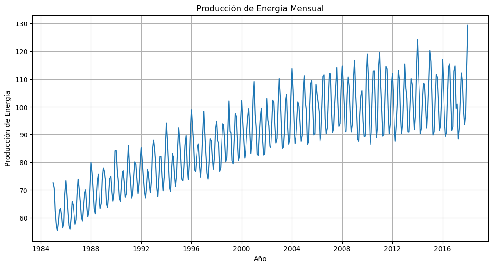
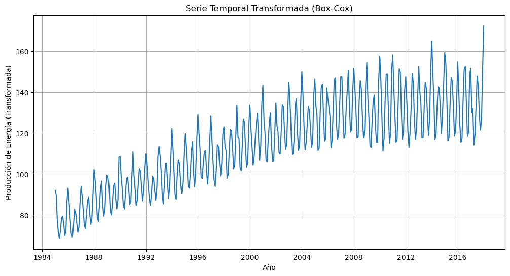

```python
# Importar pandas como pd
import pandas as pd
```


```python
# Importar numpy como np
import numpy as np
```


```python
# Importar matplotlib.pyplot como plt
import matplotlib.pyplot as plt
```


```python
# Importar SARIMAX de statsmodels.tsa.statespace
from statsmodels.tsa.statespace.sarimax import SARIMAX
```


```python
# Importar random
import random
```


```python
# Importar math
import math

```


```python
# Importar boxcox de scipy.stats
from scipy.stats import boxcox
```


```python
# Importar acorr_ljungbox de statsmodels.stats.diagnostic
from statsmodels.stats.diagnostic import acorr_ljungbox
```


```python
# Cargar los datos
data = pd.read_csv('Electric_Production.csv')
data['DATE'] = pd.to_datetime(data['DATE'])
data.set_index('DATE', inplace=True)
```


```python
# Visualizar los datos
plt.figure(figsize=(12, 6))
plt.plot(data.index, data['IPG2211A2N'])
plt.title('Producción de Energía Mensual')
plt.xlabel('Año')
plt.ylabel('Producción de Energía')
plt.grid(True)
plt.show()
```


    

    


```python
# Aplicar transformación Box-Cox
data['Transformed'], _ = boxcox(data['IPG2211A2N'])
```


```python
# Visualizar la serie transformada
plt.figure(figsize=(12, 6))
plt.plot(data.index, data['Transformed'])
plt.title('Serie Temporal Transformada (Box-Cox)')
plt.xlabel('Año')
plt.ylabel('Producción de Energía (Transformada)')
plt.grid(True)
plt.show()
```


    

    


```python
# Función para calcular RMSE
def rmse(y_true, y_pred):
    return np.sqrt(np.mean((y_true - y_pred) ** 2))
```


```python
# Función de Recocido Simulado
def recocido_simulado(data, max_iteraciones=30, temperatura_inicial=10):
    mejores_parametros = (1, 1, 1, 1)  # Inicializar los mejores parámetros
    mejor_rmse = float('inf')  # Inicializar con un valor alto

    parametros_actuales = mejores_parametros
    rmse_actual = mejor_rmse

    temperatura = temperatura_inicial

    for _ in range(max_iteraciones):
        parametros_vecinos = tuple(random.choice([-1, 1]) * random.randint(0, 8) + parametros_actuales[i] for i in range(4))
        parametros_vecinos = tuple(max(0, x) for x in parametros_vecinos)  # Garantizar que no haya valores negativos

        modelo = SARIMAX(data['Transformed'], order=parametros_vecinos[:3], seasonal_order=(0, 0, 0, 0))
        resultado = modelo.fit(disp=False)
        predicciones = resultado.get_forecast(steps=50).predicted_mean
        datos_validacion = data['Transformed'][-50:]
        rmse_vecino = rmse(datos_validacion, predicciones)

        if rmse_vecino < rmse_actual or random.random() < math.exp((rmse_actual - rmse_vecino) / temperatura):
            parametros_actuales = parametros_vecinos
            rmse_actual = rmse_vecino

            if rmse_actual < mejor_rmse:
                mejores_parametros = parametros_actuales
                mejor_rmse = rmse_actual

        temperatura *= 0.95  # Factor de reducción de temperatura

    return mejores_parametros
```


```python
# Ejecutar el algoritmo de Recocido Simulado
def recocido_simulado(data, max_iteraciones=30, temperatura_inicial=10):
    mejores_parametros = (1, 1, 1, 1)  # Inicializar los mejores parámetros
    mejor_rmse = float('inf')  # Inicializar con un valor alto

    parametros_actuales = mejores_parametros
    rmse_actual = mejor_rmse

    temperatura = temperatura_inicial

    for _ in range(max_iteraciones):
        parametros_vecinos = tuple(random.choice([-1, 1]) * random.randint(0, 8) + parametros_actuales[i] for i in range(4))
        parametros_vecinos = tuple(max(0, x) for x in parametros_vecinos)  # Asegurar que no haya valores negativos

        modelo = SARIMAX(data['Transformed'], order=parametros_vecinos[:3], seasonal_order=(0, 0, 0, 0))
        resultado = modelo.fit(disp=False)
        predicciones = resultado.get_forecast(steps=50).predicted_mean
        datos_validacion = data['Transformed'][-50:]
        rmse_vecino = rmse(datos_validacion, predicciones)

        if rmse_vecino < rmse_actual or random.random() < math.exp((rmse_actual - rmse_vecino) / temperatura):
            parametros_actuales = parametros_vecinos
            rmse_actual = rmse_vecino

            if rmse_actual < mejor_rmse:
                mejores_parametros = parametros_actuales
                mejor_rmse = rmse_actual

        temperatura *= 0.95  # Factor de reducción de temperatura

    return mejores_parametros
```


```python
# Ejecutar el algoritmo de Recocido Simulado
mejores_parametros = recocido_simulado(data)
print('Mejores parámetros SARIMA:', mejores_parametros)
```

```python
# Construir el modelo SARIMA con los mejores parámetros
modelo = SARIMAX(data['Transformed'], order=mejores_parametros[:3], seasonal_order=(0, 0, 0, 0))
resultado = modelo.fit(disp=False)
```

```python
# Hacer predicciones para los próximos 50 puntos
predicciones = resultado.get_forecast(steps=50).predicted_mean
```

```python
# Deshacer la transformación Box-Cox en las predicciones
predicciones = np.exp(predicciones)
```

```python
# Evaluar el modelo con RMSE
datos_validacion = data['IPG2211A2N'][-50:]
rmse_puntaje = rmse(datos_validacion, predicciones)
print('RMSE del modelo SARIMA:', rmse_puntaje)
```
   